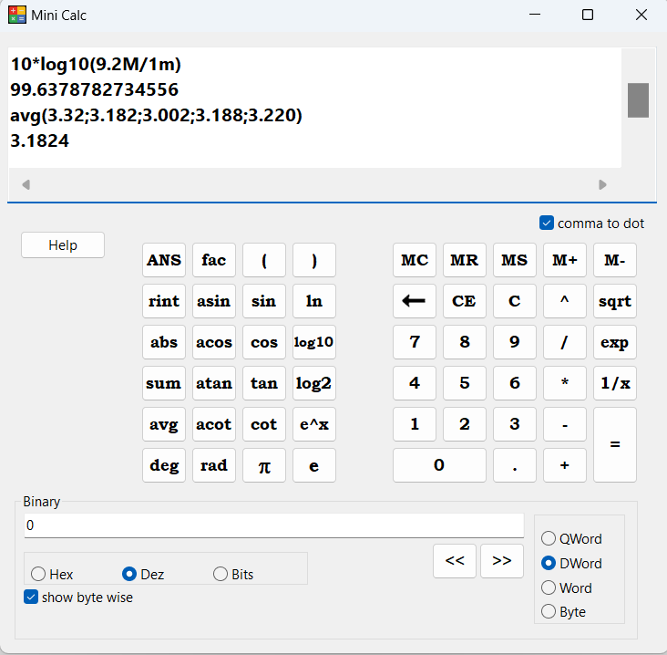
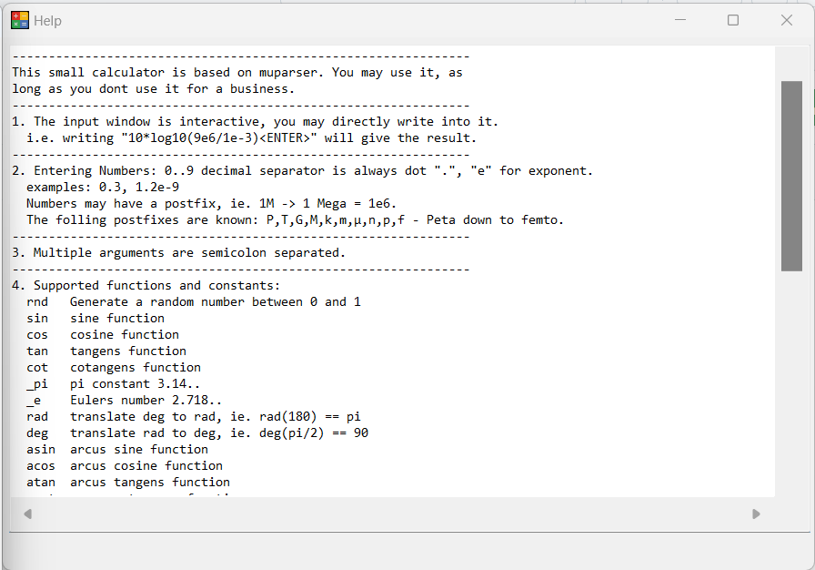

# mini-calc
a small scientific calculator, written in pascal.

## Intro
This small calculator app works text based.

Therefore, the small display window is the most important user input, you may write here without using any button.
The buttons are basically just support to remember the syntax.

You may define variables and use them in one line of text. They are active for just one text line. If you press the *=* button or use *ENTER*, the result is evaluated and printed into the very next line. Also, the last result can be pasted into text using the *ANS* button. But remember, this is text-based. You have to check the text..

## Entering formulas
One example to enter a formula, is to convert power in dBm. for a power of 9.2 mega watts..
You would enter `10*log10(9.2M/1m)`. You may use the help of the buttons, or type directly into the input window.

* log10 means log to the base of 10
* 9.2M means 9.2 mega (watts)
* 1m means 1 milli (watts)

After that, you press *ENTER*, or click on the *=* button.

## Features
*  rnd   Generate a random number between 0 and 1
*  sin   sine function
*  cos   cosine function
*  tan   tangens function
*  cot   cotangens function
*  _pi   pi constant 3.14..
*  _e    Eulers number 2.718..
*  rad   translate deg to rad, ie. rad(180) == pi
*  deg   translate rad to deg, ie. deg(pi/2) == 90
*  asin  arcus sine function
*  acos  arcus cosine function
*  atan  arcus tangens function
*  acot  arcus cotangens function
*  sinh  hyperbolic sine function
*  cosh  hyperbolic cosine
*  tanh  hyperbolic tangens function
*  asinh hyperbolic arcus sine function
*  acosh hyperbolic arcus tangens function
*  atanh hyperbolic arcur tangens function
*  log2  logarithm to the base 2
*  log10 logarithm to the base 10
*  log   see ln
*  ln    logarithm to base e (2.718)
*  exp   e raised to the power of x
*  sqrt  square root of a value
*  ^     power of, ie. 3^2 == 8
*  fac   factorial, usually written as exclamation after number
*  sign  sign function -1 if x<0; 1 if x>0
*  rint  round to nearest integer
*  abs   absolute value
*  min   min of all semicolon separated arguments
*  max   max of all semicolon separated arguments
*  sum   sum of all semicolon separated arguments
*  avg   mean value of all semicolon separated arguments
*  SI system multipliers, Peta..femto are available as postfixes.
   *  1M -> 1Mega == 1e6
   *  1m -> 1milli == 1e-6
   *  1µ -> 1micro == 1e-6
*  convert bits <-> integer <-> hex numbers, and bit-shift them  

## Using the help button
There is a basic help function. The *Help* button opens a new window with some basic instructions.

